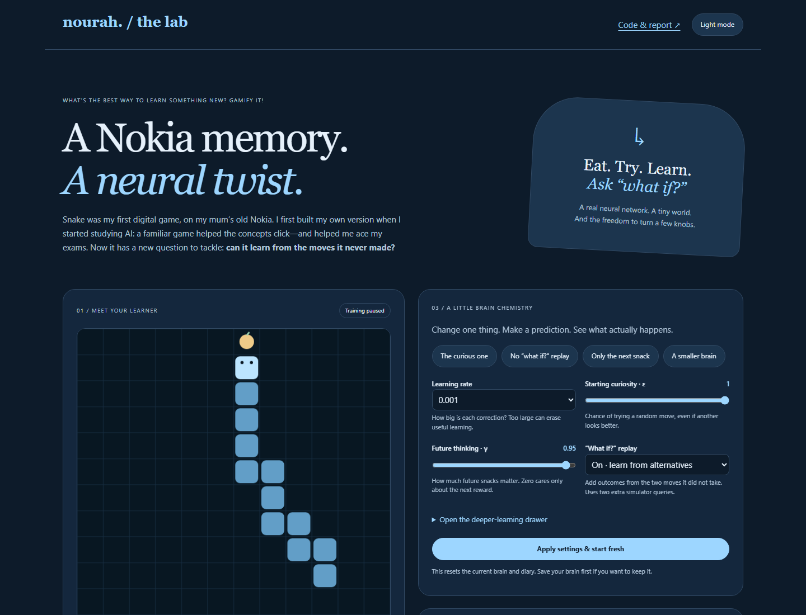
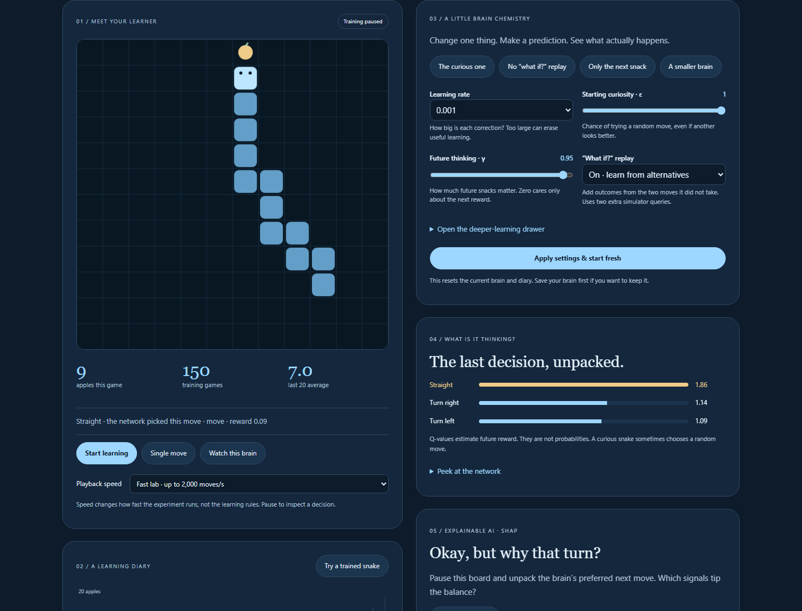
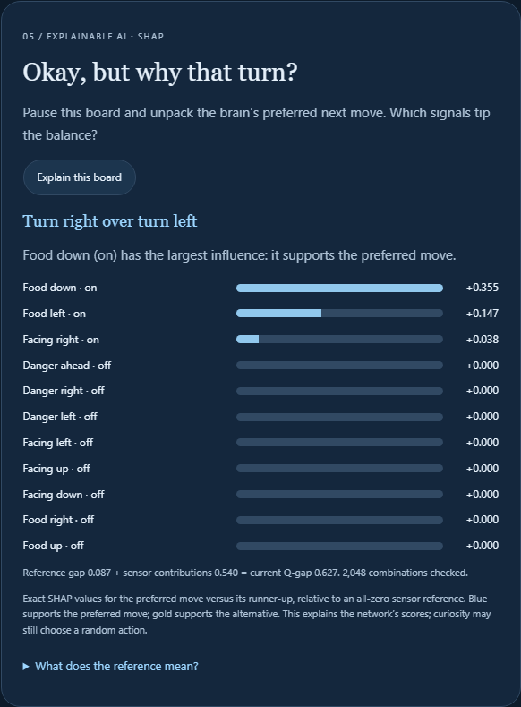
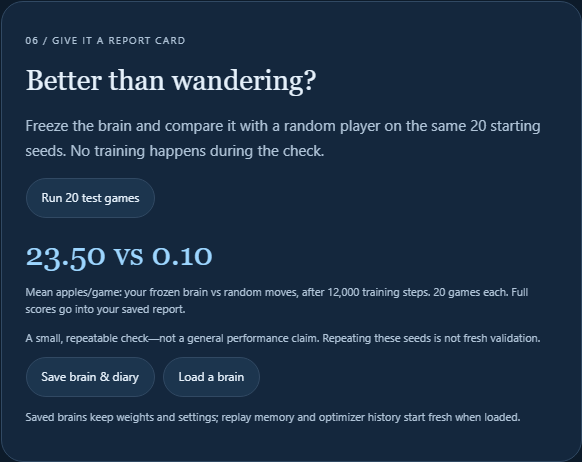

# Snake Learning Lab

**What’s the best way to learn something new? Gamify it!**

Snake was the first digital game I played on my mum’s old Nokia, and it stayed with me. When I first started studying AI, I built my own version to make unfamiliar concepts click—and it helped me ace my exams. That early prototype used simple movement rules. This version gives the little snake a neural network that actually learns.

Turn the knobs and see how rewards guide behavior, why exploration matters and how learning rate changes training. It’s a familiar, playful way to make abstract AI concepts click.

**[Play the learning lab](https://www.nora-alotaibi.com/snake-game/) · [Read the technical report](REPORT.md) · [Sources & credits](SOURCES.md)**

## Can it learn from a move it never made?

The lab uses Double DQN with an optional **“what if?” replay** extension. Before a real move, it copies the game and simulates the two alternatives. Those one-step experiences join replay memory without changing the real game. It is an application of model-based planning ideas, not a claim to have invented a new RL algorithm.

The contribution goes beyond presentation: an isolated simulator branch, real-versus-simulated experience tracking, and a controlled ablation with equal actual-game steps and optimizer updates. Extra simulation is disclosed rather than treated as free experience.

Across three training seeds and 50 evaluation games per trained model, the final mean was **20.07 apples/game for standard replay and 20.97 for what-if replay**. The extension won only one of the three seed comparisons and performed worse early on two seeds. That is a mixed result, not proof that it is better. [See every run, its budget and limitations](REPORT.md).

## Why did it turn? Ask SHAP.

Click **Explain this board** to pause and see which danger, heading and food signals support the brain’s preferred move over its runner-up. The lab calculates exact baseline Shapley values across all 2,048 sensor combinations, shows a signed contribution chart and a plain-language takeaway, and includes the explanation in your exported diary. No extra package or paid API is needed.

## Four views inside the lab

| A familiar game, a new question | Watch learning happen |
| --- | --- |
|  |  |
| **Peek at the brain** | **Give it a report card** |
|  |  |

These are screenshots of the running application, not mockups. The on-screen 20-game report card uses different seeds from the report’s final 50-game comparison.

## Turn the knobs and ask better questions

- **Learning rate:** how much one correction changes the weights.
- **Curiosity / epsilon:** random exploration versus using current estimates; includes a decay and a floor.
- **Future thinking / gamma:** how much later rewards matter.
- **Network width and depth:** neurons and hidden layers that actually change the model.
- **Replay capacity and batch size:** how much it remembers and how many examples share an update.
- **Target refresh:** how often the stable reference network catches up.
- **Food, collision and distance rewards:** the objective you are teaching. The distance hint is explicit assistance.
- **What-if replay:** add two simulated alternatives or use the standard baseline.
- **Seed:** repeat the same training setup. Playback speed changes wall-clock pace, not the learning rules.

Preset buttons stage a single change. Apply settings starts a fresh brain. You can pause, take one step, watch without training, run a frozen comparison, and save or reload weights. Loaded checkpoints keep settings and policy weights; replay and optimizer history restart. The network visualizer shows real activations and Q-values, not decorative neurons or probabilities.

## Run locally

The browser lab has no npm dependencies, API keys or model downloads.

```sh
python -m http.server 8503 --directory web
```

Open **http://localhost:8503/** in a current Chrome, Edge or Firefox browser. Use a local HTTP server, not a `file://` tab, because module workers require it. Training runs in a worker and pauses when the page is hidden. Your data stays in the browser.

```sh
node --test tests/*.test.mjs
node scripts/ablation.mjs
```

Node 20+ runs the tests and reproduces the ablation. Seventeen core tests passed, including numerical gradient checks, optimizer learning, game rules, seeded reproducibility, target-network isolation, frozen evaluation, parameter effects and counterfactual simulation. [Browser checks](results/browser-checks.json) cover real weight updates, mode switching, evaluation, save/load, controls and mobile layout.

## Where the story began

`Snake_AI_Game.py` preserves the original Python/Pygame prototype:

```sh
python -m pip install -r requirements.txt
python Snake_AI_Game.py
```

That older file still uses random and food-seeking rules; its learning-rate and neuron labels do not train a model. The actual neural-learning implementation is in `web/core.mjs`. This distinction is deliberate so the project’s history stays understandable.

## The honest limits

The agent sees eleven engineered signals, not the entire board or pixels. It can trap itself, and results depend on the seed, reward design and training budget. What-if replay has privileged access to the exact simulator and adds computation. Three training seeds are a small study. This is a reproducible learning lab and technical extension, not a claim of state-of-the-art Snake performance.

See [the report](REPORT.md) for the method and raw results, and [the source notes](SOURCES.md) for the papers and specific GitHub implementations that informed the work.
